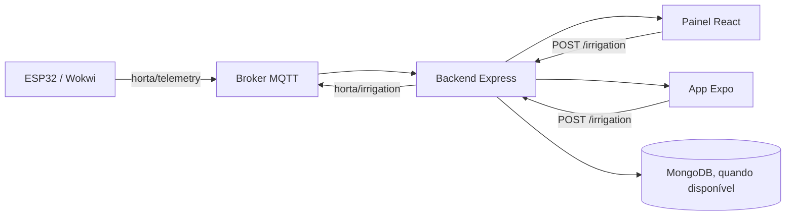

# Horta Comunitária

Projeto de monitoramento e automação de uma horta comunitária com sensores IoT, API backend, painel web e app mobile.

## Visão geral

O sistema atual implementa o fluxo principal:

- ESP32/Wokwi coleta umidade do solo, temperatura e umidade relativa do ar.
- Os dados são publicados em MQTT no tópico `horta/telemetry`.
- O backend Express recebe a telemetria, expõe a API REST e emite eventos em tempo real via Socket.IO.
- O painel web e o app mobile consomem o mesmo estado da horta e permitem controlar a irrigação.
- A irrigação pode ser acionada manualmente ou devolvida ao modo automático.

A implementação está direcionada para demonstração funcional e validação do fluxo operacional real, e não para autenticação/usuários ainda.

## Arquitetura



## Funcionalidades implementadas

### Backend

O backend em `backend/src/index.js` implementa:

- `GET /health`: health check do serviço.
- `GET /status`: retorna o último estado da horta com telemetria e irrigação.
- `GET /telemetry/history`: histórico recente de telemetria.
- `POST /irrigation`: aceita `on`, `off` e `auto`.
- `GET /harvest`: lista colheitas disponíveis.
- `POST /harvest`: cria nova colheita.
- `PUT /harvest/:id/reserve`: reserva uma colheita.

O servidor também:

- recebe mensagens MQTT em `horta/telemetry` e `horta/irrigation`;
- atualiza o estado em memória em tempo real;
- emite eventos `status:update` e `telemetry:update` por Socket.IO;
- salva telemetria no MongoDB quando `MONGO_URI` está disponível;
- usa fallback em memória quando o banco não está acessível.

### Painel web

O frontend em `app/web/src/App.tsx` implementa:

- dashboard de status geral;
- gráfico de umidade/temperatura/umidade relativa;
- controle manual de irrigação (`on`, `off` e `auto`);
- histórico recente de telemetria;
- cadastro e reserva de colheitas;
- atualização em tempo real via Socket.IO.

A URL da API é configurada por `VITE_API_URL` e usa `http://localhost:3000` como padrão.

### App mobile

O app em `app/mobile` usa Expo + React Native e contém as telas:

- `Status`
- `Irrigação`
- `Colheitas`

As telas usam a mesma API e os mesmos conceitos do painel web, com botões para ligar/desligar a irrigação e registrar reservas de colheitas.

### IoT / firmware

A pasta `iot/` contém o firmware de referência para ESP32 em Arduino/C++.

Ele:

- lê DHT22 e sensor de solo;
- publica telemetria em `horta/telemetry`;
- escuta comandos em `horta/irrigation`;
- usa lógica de irrigação automática baseada em limiar de umidade do solo;
- aceita override manual via comando MQTT.

O código do firmware define a estrutura básica do fluxo de integração, e o backend aceita o mesmo conjunto de comandos e payloads esperados pela camada IoT.

## Estrutura do repositório

```text
backend/          API REST + MQTT + Socket.IO
app/web/          painel web em React + TypeScript
app/mobile/       app Expo para Android/iOS
iot/              firmware ESP32/Wokwi
docs/             arquitetura e documentação de apoio
mosquitto/        configuração do broker MQTT
wokwi/            artefatos e scripts de compilação do Wokwi
Dockerfile        imagem do painel web
backend/Dockerfile imagem do backend
docker-compose.yml stack principal do projeto
```

## Requisitos

- Node.js 18+
- npm
- Docker Desktop (opcional, para execução em container)
- broker MQTT acessível localmente ou via rede
- MongoDB opcional, mas recomendado para persistência

## Como executar localmente

### 1) Backend

```bash
cd backend
npm install
copy .env.example .env
npm run dev
```

Arquivo `.env` padrão:

```env
PORT=3000
MQTT_BROKER=mqtt://localhost:1883
MQTT_TELEMETRY_TOPIC=horta/telemetry
MQTT_IRRIGATION_TOPIC=horta/irrigation
MONGO_URI=mongodb://localhost:27017/horta-comunitaria
```

Se `MONGO_URI` não estiver disponível, o backend continua operando em modo de demonstração com dados em memória.

### 2) Painel web

```bash
npm --prefix app/web install
npm --prefix app/web run dev
```

Acesse:

```text
http://localhost:5173
```

Para build de produção:

```bash
npm --prefix app/web run build
npm --prefix app/web run preview
```

### 3) App mobile

```bash
cd app/mobile
copy .env.example .env
npm install
npx expo start
```

Arquivo `.env` usado pelo app:

```env
EXPO_PUBLIC_API_URL=http://192.168.0.51:3000
```

Importante:

- no celular físico, use o IP da máquina na rede local;
- não use `localhost` no dispositivo móvel;
- em emulador Android, `10.0.2.2` costuma funcionar;
- o celular e o computador devem estar na mesma rede Wi‑Fi.

### 4) Docker Compose

Na raiz do projeto:

```bash
docker compose up --build -d
```

Serviços principais:

- API: `http://localhost:3000`
- Web: `http://localhost:8080`
- MongoDB: `localhost:27017`
- Mosquitto: `localhost:1883`

Validação rápida:

```bash
docker compose ps
curl http://localhost:3000/health
curl http://localhost:3000/status
```

## MQTT e payloads

### Tópico de telemetria

`horta/telemetry`

Exemplo:

```json
{
  "soilMoisture": 42,
  "temperature": 26.4,
  "humidity": 68.1,
  "timestamp": "2026-09-28T12:00:00.000Z"
}
```

### Tópico de irrigação

`horta/irrigation`

Comandos aceitos:

```json
{ "command": "on", "mode": "manual" }
{ "command": "off", "mode": "manual" }
{ "command": "auto", "mode": "automatic" }
```

A ação `auto` retorna a irrigação ao controle automático, enquanto `on` e `off` fazem override manual.

## Endpoints principais da API

```text
GET    /health
GET    /status
GET    /telemetry/history
POST   /irrigation
GET    /harvest
POST   /harvest
PUT    /harvest/:id/reserve
```

Exemplo de comando de irrigação:

```bash
curl -X POST http://localhost:3000/irrigation \
  -H "Content-Type: application/json" \
  -d '{"action":"on","mode":"manual"}'
```

## Fluxo de funcionamento

1. O sensor publica dados em MQTT.
2. O backend recebe o payload e atualiza o estado atual.
3. O backend expõe `/status` e `/telemetry/history`.
4. O painel web e o mobile renderizam o estado atualizado.
5. Quando um usuário ativa a irrigação pela interface, a API publica um comando no tópico MQTT e atualiza o estado em tempo real.

## Observações importantes

- O projeto ainda prioriza a camada funcional de IoT e automação sobre autenticação e perfis de usuário.
- Em ausência de MongoDB, a API funciona com estado em memória e dados demo.
- O backend continua emitindo eventos realtime via Socket.IO mesmo sem banco conectado.
- O painel web e o mobile refletem o mesmo estado do backend e não dependem de polling manual para atualizar a tela principal.

## Wokwi / compilação do firmware

Na raiz do projeto, no Windows:

```powershell
npm run compile:wokwi
```

Esse comando tenta localizar `wokwi/arduino-cli.exe` ou um `arduino-cli` no PATH e gera o firmware em `wokwi/build`.

## Roadmap prático

Próximas evoluções típicas para a continuidade do projeto:

- autenticação e perfis de usuário;
- persistência mais robusta de colheitas e reservas;
- testes automatizados de API e MQTT;
- melhorias de observabilidade e alertas;
- refinamento da lógica de irrigação e validação de hardware em bancada.

O que está no repositório hoje é a base operacional da horta conectada: sensores, backend, painel, mobile e integração MQTT funcionando como um fluxo coerente.

1. Validar Docker, MQTT e MongoDB.
2. Integrar o web com a API.
3. Persistir colheitas e reservas.
4. Configurar o mobile.
5. Validar e proteger o firmware.
6. Adicionar autenticação.
7. Automatizar testes e operação.

A primeira entrega funcional deve ser: **telemetria real aparecendo no web e comando de irrigação chegando ao ESP32**. Esse é o menor fluxo que comprova que o sistema completo está realmente integrado.

## Documentação técnica

A visão das integrações entre sensor, MQTT, backend, banco, web, mobile e atuador está em [docs/ARCHITECTURE.md](docs/ARCHITECTURE.md).

```

```
