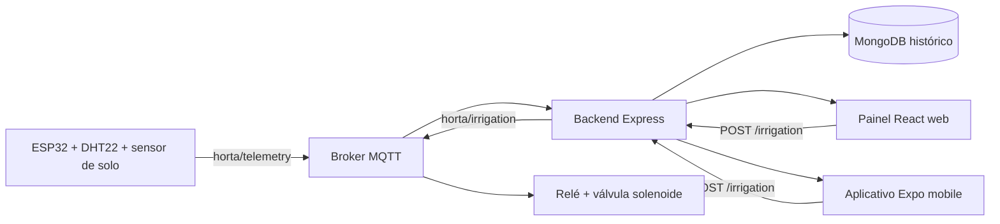

# Arquitetura do HortaComunitária

## Camadas

1. **IoT:** o firmware mede o solo e o DHT22 a cada 10 segundos. O limiar de 40% aciona a irrigação automática; qualquer comando recebido pelo MQTT assume o override manual.
2. **Backend:** Express expõe status, histórico, irrigação e colheitas. MQTT é opcional em desenvolvimento e MongoDB recebe o próximo adaptador de persistência temporal.
3. **Aplicação:** `src/` é o painel web administrativo e `app/mobile/` é o cliente Expo para voluntários e moradores.

## Tópicos MQTT

- `horta/telemetry`: `{ "soilMoisture": 42, "temperature": 26.0, "humidity": 68.0 }`
- `horta/irrigation`: comandos `{ "command": "on", "mode": "manual" }`, `{ "command": "off", "mode": "manual" }` ou `{ "command": "auto", "mode": "automatic" }`.

Comandos manuais ativam o override no ESP32. O comando `auto` libera o override e devolve a decisão ao limiar de umidade com histerese: liga abaixo de 40% e desliga acima de 60%.
